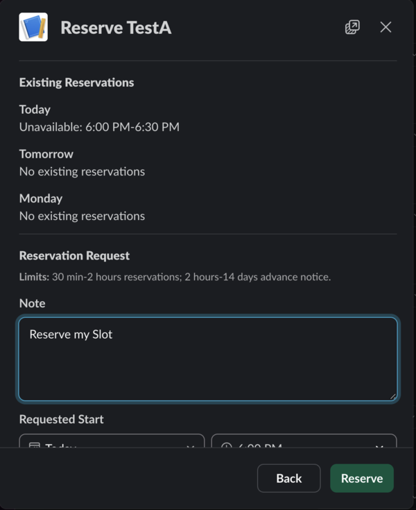
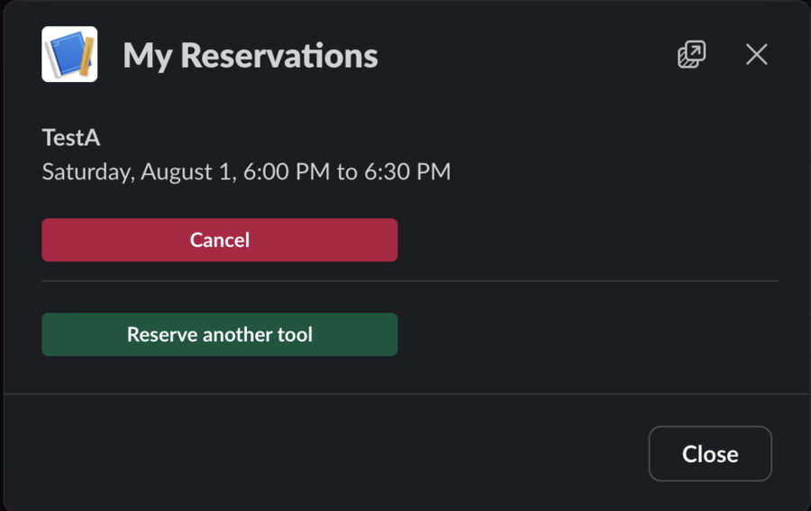

# Reservations Guide

Use reservations to check when equipment is available, reserve equipment through Slack, or manage reservations and equipment policies if your role allows it.

## View the Reservation Calendar


Select [**Reservations**]({{ reservation_url }}) in the Equipment Status Board navigation.

Select **Reservations** in the Equipment Status Board navigation.


The calendar shows each reservable equipment item in a separate column. A block labeled **Reserved** shows an unavailable time. The calendar does not show the name of the member who made the reservation.

Use **Previous**, the date field, or **Next** to view another day. If the page says that no reservable tools are configured, ask a staff member whether reservations are available for the equipment you need.


## Reserve Equipment in Slack

Anyone who can use the ESB Slack app can reserve equipment. An Equipment Status Board account is not required.

### Create a Reservation

1. Enter `/esb-reserve` in Slack.
2. Select **Reserve** for the equipment you need.
3. Review the listed unavailable times and reservation limits.
4. Enter a start time and an end time.
5. Enter a note if it helps other users understand the reservation.
6. Select **Reserve**.

{ .docs-screenshot-compact }

Slack shows a confirmation with the equipment, time, and note.

If your requested time is unavailable or does not meet the equipment reservation policy, Slack shows the reason. Select **Choose another time** and enter a valid time.

### View or Cancel Your Reservations

1. Enter `/esb-reserve` in Slack.
2. Select **My reservations**.
3. To cancel a reservation, select **Cancel reservation**.
4. Review the reservation details.
5. Select **Cancel reservation** to confirm.

{ .docs-screenshot-compact }

You can cancel only an active reservation that belongs to your Slack identity or linked ESB account. If staff later creates an ESB account for you, reservations you made previously through Slack still appear here. Slack confirms when the reservation is canceled.


## Manage Reservations

Technicians and staff can manage reservations in the web application. Select **Admin**, then select **Reservations**.

### View Reservations and History

The **Calendar** view shows reservations for one day. Use **Previous**, **Today**, or **Next** to change the displayed day.

Select **History** to view reservation records. Use the filters to limit the results by date range, area, equipment, member, status, or source. The source is either **Slack** or **Admin**.

An active reservation can be edited or canceled. A canceled reservation remains in the history.

### Create a Reservation or Administrative Hold

1. Select **New Reservation**.
2. Select **Member reservation** or **Admin hold**.
3. Select the equipment.
4. If you selected **Member reservation**, select the member.
5. Enter the start date, start time, duration, and note.
6. Select **Review reservation**.
7. Review the reservation details and any policy warnings.
8. Confirm the reservation.

An administrative hold blocks a time without assigning the reservation to a member. All administrative reservations and holds require a note.

### Edit or Cancel a Reservation

To edit an active reservation, select **Edit**, update the fields, review the changes, and confirm the replacement reservation. The system cancels the previous reservation and preserves it in the history.

To cancel an active reservation, select **Cancel**, then confirm the cancellation. You cannot edit or cancel a reservation that is already canceled.

## Configure Reservation Policies

Only staff can configure reservations for an equipment item.

1. Open the equipment detail page.
2. Select **Reservation Settings**.
3. Select **Allow reservations** to make the equipment available for reservations.
4. Enter a **Reservation slug**.
5. Set the advance-notice, duration, and slot-granularity limits.
6. Select **Save Reservation Settings**.

Use a reservation slug that contains lowercase letters, numbers, and single hyphens only. For example, use `laser-cutter-1`.

Set **Minimum advance notice** and **Maximum advance notice** to control how soon and how far ahead members can reserve the equipment. Set **Minimum duration** and **Maximum duration** to control reservation length. Set **Slot granularity** to control the allowed start-time and duration increments.

The maximum advance notice must be at least the minimum advance notice. The maximum duration must be at least the minimum duration. Both duration limits must be exact multiples of the slot granularity.

Clear **Allow reservations** to prevent new reservations for the equipment. You cannot configure reservations for archived equipment.
