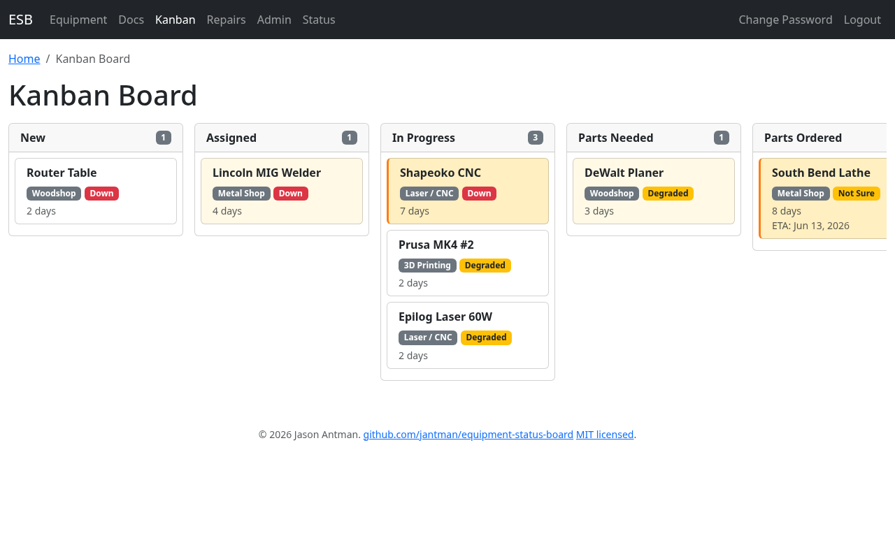
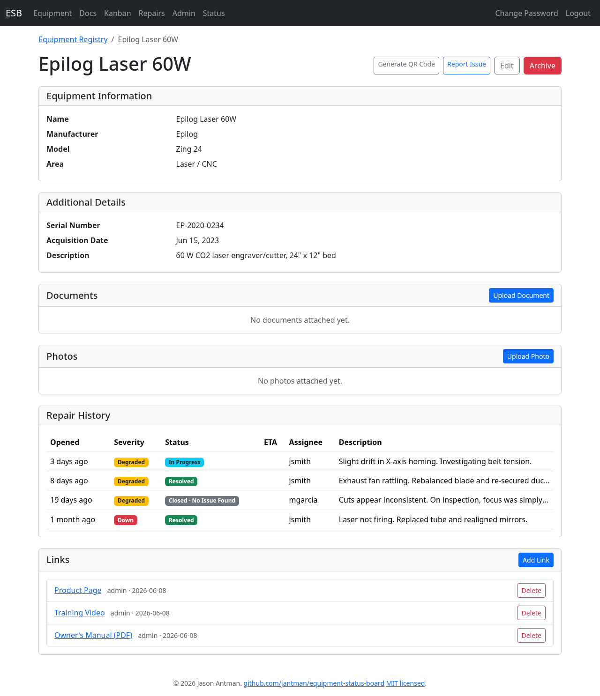
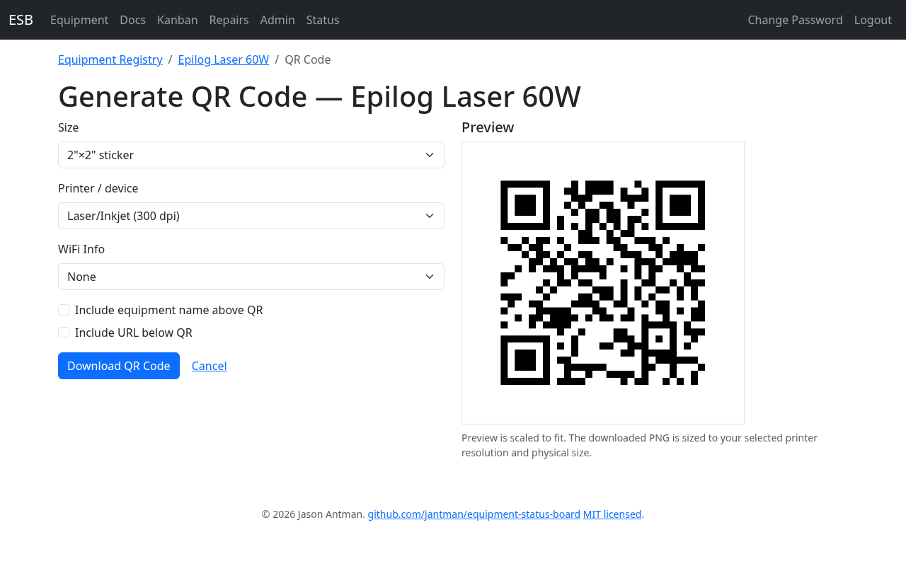
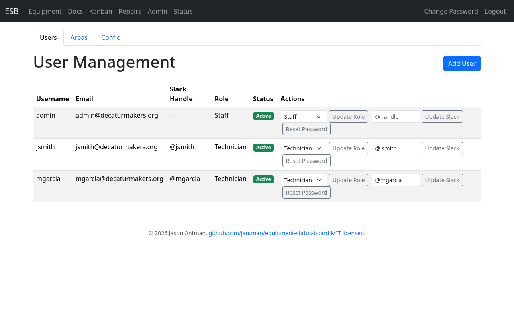
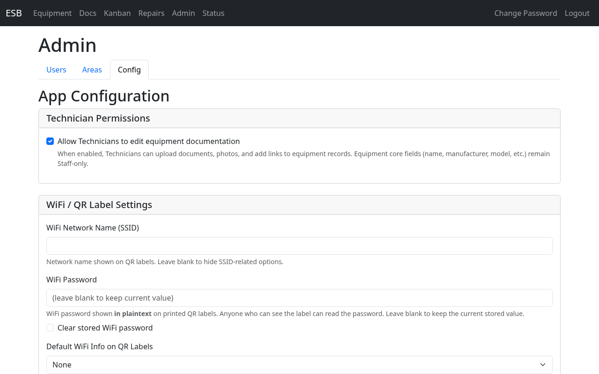

# Staff Guide

This guide is for makerspace managers with the Staff role. You have full access to the Equipment Status Board, including equipment management, user administration, and system configuration. This guide focuses on the capabilities unique to staff — for repair record management, see the [Technicians Guide](technicians.md), which also applies to you.

## Getting Started

### Logging In

Go to {{ base_url_display }} and log in with your username and password. After logging in, you land on the **Kanban Board** — your primary tool for monitoring repair activity.

### Navigation

The navigation bar gives you access to all areas of the system:

| Link | What It Shows |
|------|--------------|
| Kanban | Kanban board overview of all open repairs |
| Repair Queue | Sortable/filterable repair table (same view as Technicians) |
| Equipment | Equipment registry — browse, add, edit equipment |
| Users | User management — add, edit, manage accounts |
| Status | Status dashboard — color-coded equipment grid |

## Using the Kanban Board

The Kanban board gives you an at-a-glance view of all active repairs organized by status. It's designed to answer one question immediately: **what's stuck?**

### Reading the Board

Each column represents a repair status:

- **New** — Reported but not yet assessed
- **Assigned** — Someone has taken responsibility
- **In Progress** — Actively being worked on
- **Parts Needed** — Waiting for parts to be identified or ordered
- **Parts Ordered** — Parts ordered, waiting for delivery
- **Parts Received** — Parts in hand, ready to install
- **Needs Specialist** — Requires expertise beyond current technicians

Resolved and Closed repairs are not shown on the Kanban board — only active repairs appear.

### Card Information

Each card on the board shows:

- Equipment name
- Area (e.g., Woodshop)
- Severity indicator (color-coded)
- Time in current column

Cards within each column are ordered by time-in-column, with the oldest at the top.

### Aging Indicators

The Kanban board uses visual aging indicators so you can spot stuck items without reading details:

| Age in Column | Visual Treatment |
|---------------|-----------------|
| 0-2 days | Default styling — normal |
| 3-5 days | Warm tint — starting to age |
| 6+ days | Strong indicator — needs attention |

If a card has a strong aging indicator, it has been sitting in that status for too long and likely needs intervention — a follow-up with the assigned technician, a parts order, or escalation.

### Taking Action

The Kanban board is a read-only overview. To take action on a repair, click a card to open the full repair record, then make changes there (update status, add notes, reassign, etc.).

### Desktop vs. Mobile

On desktop, columns are displayed side by side with horizontal scrolling if needed. On mobile, columns are stacked vertically as collapsible sections.

## Managing Equipment

### Viewing the Registry

Click **Equipment** in the navigation bar to see all equipment in the system. Use the area filter to narrow the list.

### Creating Equipment

1. Click the **Add Equipment** button
2. Fill in:
    - **Name** (required) — e.g., "SawStop #1"
    - **Manufacturer** — e.g., "SawStop"
    - **Model** — e.g., "PCS175"
    - **Area** (required) — select the area where the equipment is located
3. Click Save

### Editing Equipment

1. Click on a piece of equipment to open its detail page
2. Click the **Edit** button
3. Update any fields as needed
4. Click Save

The edit form also includes a **MAC Machine Name** field for linking equipment to a Machine Access Control machine — see [Linking Equipment to a MAC Machine](#linking-equipment-to-a-mac-machine) below.

### Adding Documentation

From the equipment detail page, you can upload and manage reference materials:

- **Documents** — Upload manuals, guides, and reference PDFs with category labels:
    - Owner's Manual
    - Service Manual
    - Quick Start Guide
    - Training Video
    - Safety Data Sheet
    - Other
- **Photos** — Upload equipment photos for identification
- **Links** — Add external URLs for product pages, support sites, training videos, and other online resources

### Repair History

The equipment detail page includes a **Repair History** table listing every repair record that has ever been filed against that piece of equipment — both open and resolved, **newest first**. Each row shows when the issue was opened, its severity, current status, assignee, and a short description. Click any row to jump to the full repair record, including timeline notes and photos.

Closed records — whether "Resolved", "Closed - No Issue Found", or "Closed - Duplicate" — remain in the history permanently so you can trace the repair history of a machine over its lifetime.


### Linking Equipment to a MAC Machine

This deployment is connected to a [Machine Access Control](https://github.com/jantman/machine-access-control) (MAC) system, so equipment can be linked to a physical machine to show live status and enable machine controls.

To link a piece of equipment:

1. Open the equipment's detail page and click **Edit**.
2. Set **MAC Machine Name** to the machine's `name` in MAC (ask an administrator if you're unsure of the exact name).
3. Click Save.

Each MAC machine name may be linked to only one (non-archived) piece of equipment; saving a name already in use is rejected with an error. Leave the field blank to unlink.

Once linked, the equipment detail page gains a **MAC Machine Status** card, and status badges appear on the dashboard, kiosk, and public equipment page (subject to the display settings — see [MAC Machine Status Display](#mac-machine-status-display)).

### MAC Machine Status, Controls & Activity

On a linked equipment's detail page, the **MAC Machine Status** card shows:

- The machine's current **state** — In Use, Idle, Oops, Locked Out, or Unknown — and, when available, the current user and last check-in time.
- Three control buttons (staff only), each with a confirmation prompt:
    - **Oops** — flag the machine as needing attention in MAC.
    - **Maintenance Lockout** — lock the machine out for maintenance.
    - **Clear** — clear both the oops and the lockout so the machine is usable again.
- A **Load recent activity** button that lists the machine's recent events (logins, oops, lockouts, etc.), newest first.

Two behaviors happen automatically when MAC is connected:

- **Auto-repair on Oops** — when a machine is Oops'd (in MAC or via the button above), ESB opens a **Down** repair record for the linked equipment (if one isn't already open), attributed to the person who triggered it. It flows through the normal notification pipeline like any other new report.
- **Resolve clears the machine** — when you resolve a repair (or close it as "No Issue Found") and no other repair is still open for that equipment, ESB automatically clears the machine's oops/lockout in MAC so it's usable again. Closing a repair as **"Closed - Duplicate"** deliberately does **not** clear the machine, because the authoritative repair is still open.


### Archiving Equipment

When a piece of equipment is retired or removed from the space, archive it instead of deleting it. Archiving is a soft delete that preserves all history (repair records, documents, photos) while removing the equipment from active views.

### Exporting the Inventory to CSV

From the equipment registry page, click the **Export CSV** button (next to **Add Equipment**) to download a spreadsheet of the equipment inventory. The file (`equipment_inventory.csv`) opens directly in Excel, Google Sheets, LibreOffice Calc, or any other spreadsheet tool.

The export includes one row per equipment item with these columns: `id`, `name`, `manufacturer`, `model`, `serial_number`, `area`, `acquisition_date`, `acquisition_source`, `acquisition_cost`, `warranty_expiration`, `description`, `is_archived`, `created_at`, and `updated_at`.

- If you have an area filter applied on the registry page, the export is scoped to just that area. Clear the filter first if you want the full inventory.
- Archived equipment is excluded by default. To include archived items, append `?include_archived=1` to the export URL (or combine with an area filter, e.g. `/equipment/export.csv?area_id=3&include_archived=1`).

## QR Code Labels

Each piece of equipment can have a printable QR code label attached to it. When a member scans the label with their phone, they land on the public equipment page, where they can see current status and report problems without needing to log in.

### Who can generate QR codes

Any logged-in user (Staff or Technician) can generate QR codes from the equipment detail page. **This feature is currently disabled** because the `ESB_BASE_URL` environment variable is not set — the **Generate QR Code** button is disabled with the tooltip "ESB_BASE_URL not configured". Ask an administrator to set it (see the [Administrators Guide](administrators.md)) to enable QR codes.

### Generating a QR code label

1. Open the equipment detail page for the item you want to label.
2. Click **Generate QR Code**.
3. Pick a size from the dropdown. Choices include square stickers (1", 1.5", 2", 3", 4"), Avery label sizes (5160 and 5163), and a US Letter full-page option.
4. Pick a **Printer / device** matching the printer you will print on: **Thermal Label (203 dpi)** for direct-thermal label printers, **Brother P-Touch (180 dpi)** for P-Touch label makers, or **Laser/Inkjet** at **300**, **600**, or **1200 dpi** for office printers. This setting makes the printed label come out at the correct physical size for the chosen printer. **Laser/Inkjet (300 dpi)** is the safe default for most office printers. (Very large sizes at very high resolution — e.g. US Letter at 1200 dpi — are rejected with a "too large" message; pick a lower resolution or smaller size.)
5. Optionally choose a **WiFi Info** option to print a network reminder above the QR code: **None**, **Header** (a "Must be on WiFi" banner), **SSID** (banner + network name), or **Password** (banner + network name + password). Options only appear when an administrator has configured the corresponding WiFi settings.
6. Optionally enable **Include equipment name above QR** to print the equipment's name at the top of the label.
7. Optionally enable **Include URL below QR** to print the scan target URL at the bottom of the label.
8. Watch the live preview update as you change options.
9. Click **Download QR Code** to download a PNG file ready to print.

Output is rendered at the selected device's resolution, with that DPI embedded in the PNG, so printing "actual size" reproduces the intended physical dimensions on that printer.

> **Tip:** URL text below the QR is most useful at label/page sizes (Avery 5163, US Letter). On small stickers (≤ 2") the URL is usually truncated and adds little value — the live preview shows the result; uncheck **Include URL below QR** if it isn't legible. On **low-resolution devices (180/203 dpi)**, the QR modules on tiny stickers (≤ 1") may be too small to scan reliably — prefer a larger sticker or a higher-resolution printer for tiny labels.

When someone scans a printed QR label, they see the public equipment status page — see the example below for the member-side view.

## Managing Areas

Click **Admin** in the navigation bar, then the **Areas** tab, to manage the areas (rooms/zones) of the makerspace.

### Creating Areas

1. Click **Add Area**
1. Enter the area **name** (e.g., "Woodshop")
1. Set the **Slack channel** for repair notifications for this area (e.g., `#woodshop-repairs`)
1. Click Save

### Editing Areas

Click an area to change its name or Slack channel mapping.

### Archiving Areas

Archive an area to remove it from active views. Existing equipment retains its area association for historical reference.

## Managing Users

Click **Admin** in the navigation bar (it opens the **Users** tab) to manage technician and staff accounts.

### User List

The user list shows:

- Username
- Email
- Role (Technician or Staff)
- Status (Active or Inactive)

### Creating Users

1. Click **Add User**
2. Fill in:
    - **Username** (required)
    - **Email** (required)
    - **Slack handle** — For Slack DM notifications
    - **Role** — Technician or Staff
3. Click Save

The system generates a temporary password. If the user has a Slack handle configured and the Slack integration is active, the temporary password is sent via Slack DM. Otherwise, it is displayed on screen one time — copy it and deliver it to the user securely.

### Changing Roles

Change a user between Technician and Staff roles directly from the user list.

### Resetting Passwords

Generate a new temporary password for a user. The password is delivered via the same mechanism as initial creation (Slack DM if available, otherwise displayed on screen).

## Configuring the System

Click **Admin** in the navigation bar, then the **Config** tab, to adjust system-wide settings.

### Technician Documentation Editing

Toggle whether Technicians can edit equipment documentation (upload documents, photos, and add links). When disabled, only Staff can manage equipment documentation.


### Notification Triggers

Enable or disable which events trigger Slack notifications:

| Setting | When It Fires |
|---------|--------------|
| New Report | A member reports a problem via QR page or Slack |
| Resolved | A repair is marked as Resolved |
| Severity Changed | The severity level of a repair changes |
| ETA Updated | An ETA is set or changed on a repair |

Notifications are sent to the area's configured Slack channel and to the `{{ oops_channel }}` channel (configurable via the `SLACK_OOPS_CHANNEL` environment variable).



### MAC Machine Status Display

Because this deployment is connected to a Machine Access Control system, the configuration page includes a **MAC Machine Status Display** section that controls which machine statuses appear on each surface. There are three groups of toggles — **Public Dashboard & Equipment Page**, **Kiosk Displays**, and **Equipment Admin/Detail** — each with a switch for the five statuses (In Use, Idle, Oops, Locked Out, Unknown).

Defaults are chosen to avoid clutter on member-facing views:

- **Public** shows only **Oops** and **Locked Out** (the statuses a member would care about before walking over).
- **Kiosk** and **Admin/Detail** show all five.

Turn a status on or off for a surface and click **Save Configuration**. When a status is turned off for a surface, its badge simply doesn't render there — the underlying data is unchanged.


## Working with Repairs

Staff have full access to the Repair Queue (accessible via the **Repair Queue** link in the navigation bar). All repair record management capabilities described in the [Technicians Guide](technicians.md) apply to you as well — viewing the queue, managing records, adding notes, changing status, assigning, and using Slack commands.

## Understanding Status

### Status Dashboard

Click **Status** in the navigation bar to see the color-coded equipment grid organized by area. This is the same view that members see — useful for quickly checking the overall health of the space.


### Static Status Page

The static status page is an externally hosted lightweight version of the status dashboard. It is automatically regenerated and pushed whenever equipment status changes. This allows members to check status from outside the makerspace network. Configuration of the static page push method is handled by an administrator via environment variables. On this deployment it is published at [{{ static_page_url }}]({{ static_page_url }}) — share that link with members who need to check status remotely.

