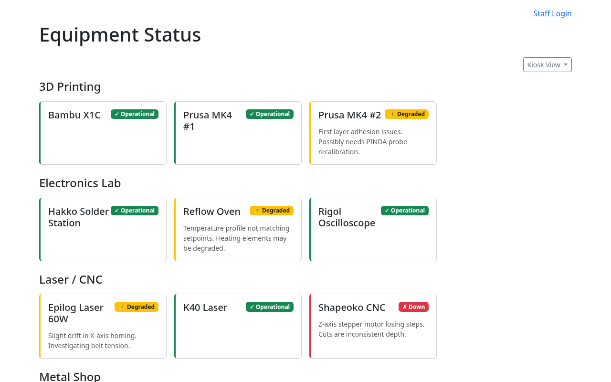
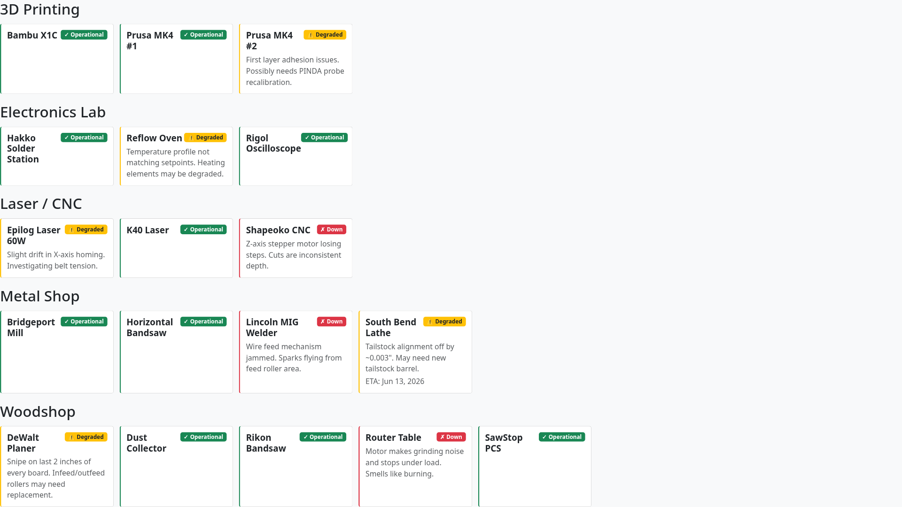
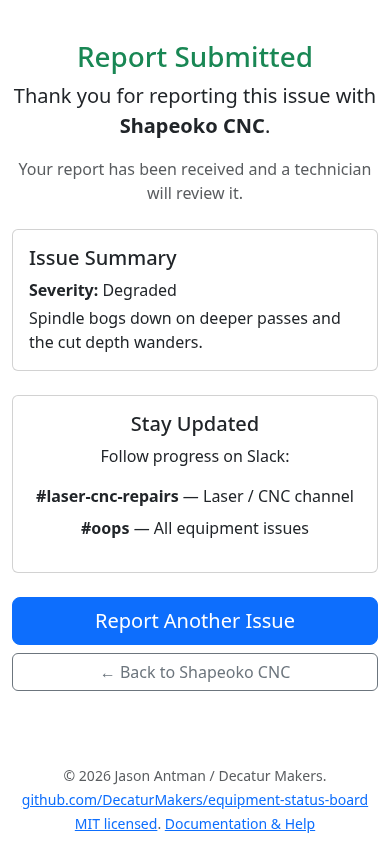

<!--
RENDER:  npx @marp-team/marp-cli docs/training/members.md --html --allow-local-files -o members.pdf
         (swap -o members.html or members.pptx for other formats)
Images live in ../images relative to this file.
PRESENTER: fill in the ESB web address posted in your space (the
  bracketed blanks on the dashboard slide).
-->

<!-- _class: lead -->

# Equipment Status Board
### Member Training

Check equipment before you use it · Report problems in seconds

<!-- Presenter: 10–15 min. Audience = any member, no account needed. Emphasize: ESB tells you if a tool works BEFORE you walk over, and reporting a problem takes 30 seconds. -->

---

## Why ESB exists

- **One place** to see whether any tool in the space is working — *before* you start a project
- Tracks every machine's status and the repairs in flight
- **Three ways to use it**, no account required:
  - 🖥️ **Web dashboard** — full status board in your browser
  - 📺 **Kiosk screens** — wall displays around the space
  - 📱 **QR stickers** — scan a specific machine
- Plus **Slack** for status checks and reporting from anywhere

<!-- Members never log in. The whole member experience is read + report. -->

---

## The only thing you must remember: the colors

✓ Operational
! Degraded
✗ Down

| Color | Status | What it means |
|-------|--------|----------------|
| 🟢 Green | **Operational** | No known issues — good to go |
| 🟡 Yellow | **Degraded** | Works, but has a known problem (or not yet assessed) — use with care |
| 🔴 Red | **Down** | Not usable — **do not run it** |

- Status is **live** — it reflects the open repair reports right now

---

## Where each tool works 📶

**Slack works anywhere** — your phone, home, on the road.

The **web dashboard and QR pages live on the makerspace network** — you must be **on WiFi** for those links to open.

- Scanning a QR sticker off-network → the page **won't load**. That's expected.
- Off-site and need status? Use **Slack** (next-to-last section).

<!-- Presenter: members do NOT get VPN — that's technicians only. -->

---

## Status Dashboard (web)

- Open the ESB web address in any browser — **no login**
- Every tracked machine, **grouped by area**
- Color-coded cards; non-green cards show the **issue + ETA**
- Bookmark it on your phone

Web address: [ posted in the space / ask staff ]

---

## Kiosk Displays (in the space)

- Large wall-mounted screens you can read across the room
- **Auto-refreshes** — always current
- Nothing to tap — **just look up** before you head to a tool

---

## QR Codes — scan a specific machine 📱

- Every machine has a **QR sticker**
- Point your **phone camera** at it → tap the link (no app)
- Opens that machine's page showing:
  - Name + area, and a **big status indicator**
  - The current **issue** if it's not green
  - **Known Issues** already being worked
  - **Equipment Info** → manuals & docs

Reminder: you must be on WiFi for the link to open.

---

## Before you report: check Known Issues

- The QR page lists any **open repairs** for that machine
- If your problem is **already listed**, it's already in the queue — **no need to report again**
- Tap **Equipment Info & Documentation** for manuals, quick-starts, and training links staff have attached

---

## Reporting a Problem

Found something broken and *not* already listed? Report it.

1. Scan the QR (or open the machine's page) → scroll to **Report a Problem**
2. Fill in:
   - **Your name** *(required)* · **Description** *(required)*
   - **Severity** — Down / Degraded / Not Sure
   - **Safety risk?** checkbox · optional **photo**
3. Tap **Submit Report**

---

## What happens after you report

- A **repair record** is created instantly
- Status updates **everywhere** — dashboard, kiosk, QR page
- Technicians are **notified in Slack**
- Confirmation page tells you **which Slack channel** to follow for progress
- Re-scan the QR anytime to see the current repair status

---

## Slack — check status from anywhere

Type these in **any** Slack channel:

- /esb-status — summary of every area
- /esb-status Woodshop — full detail for one area
- /esb-status SawStop — one specific machine

> *Equipment Status*
> *Woodshop* — ✅ 4   ⚠️ 1   ❌ 0
>   • ⚠️ DeWalt Planer — snipe on last 2″ *(ETA Jul 4)*
> *Laser / CNC* — ✅ 1   ⚠️ 1   ❌ 1
>   • ❌ Shapeoko CNC — Z-axis losing steps
> _Tip: /esb-status &lt;area&gt; for one-area detail_

Replies are only visible to you. Works off-network — Slack is in the cloud.

---

## Slack — report a problem

- Type /esb-report in any channel
- A **form pops up** — same fields as the web form:
  - Equipment · Your Name · Description · Severity · Safety risk
- Submit → instant confirmation with the **repair number**

> 🚨 *New problem report* — **Shapeoko CNC** (Laser / CNC)
> Severity: ❌ Down · reported by Jordan Lee
> Repair #42 created.

Great when you're not on WiFi, or already chatting in Slack.

---

## Recap — your member cheat sheet

- 🟢🟡🔴 **Green good · Yellow caution · Red do-not-use**
- **Check first:** web dashboard, kiosk screens, or scan the QR
- **Report fast:** QR page form, or /esb-report in Slack
- **From anywhere:** /esb-status and /esb-report in Slack
- 📶 Web + QR need **WiFi**; Slack works everywhere
- ✅ Check **Known Issues** before reporting a duplicate

More help: the <strong>Help / Docs</strong> link on the status page → Members Guide. Questions? Ask any staff member.

