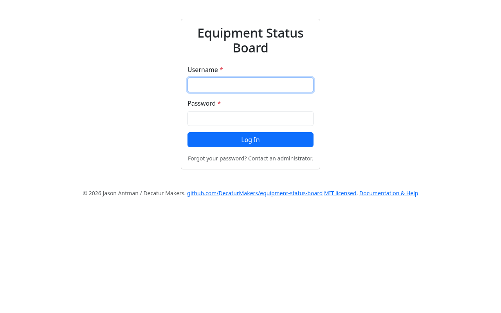
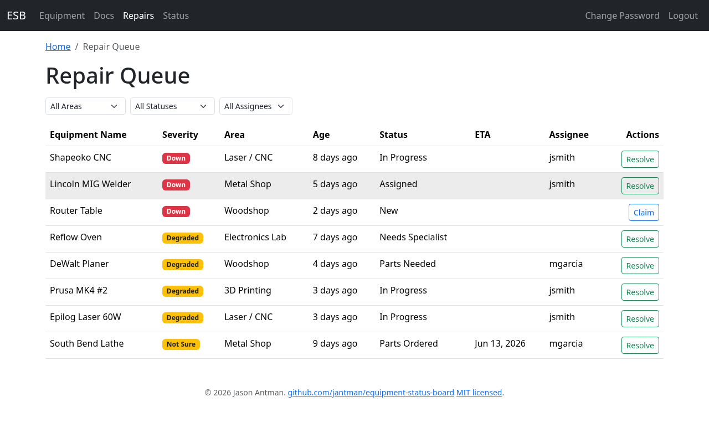
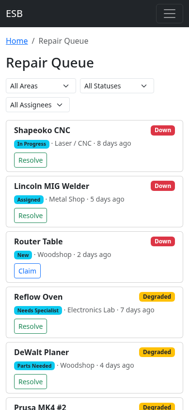
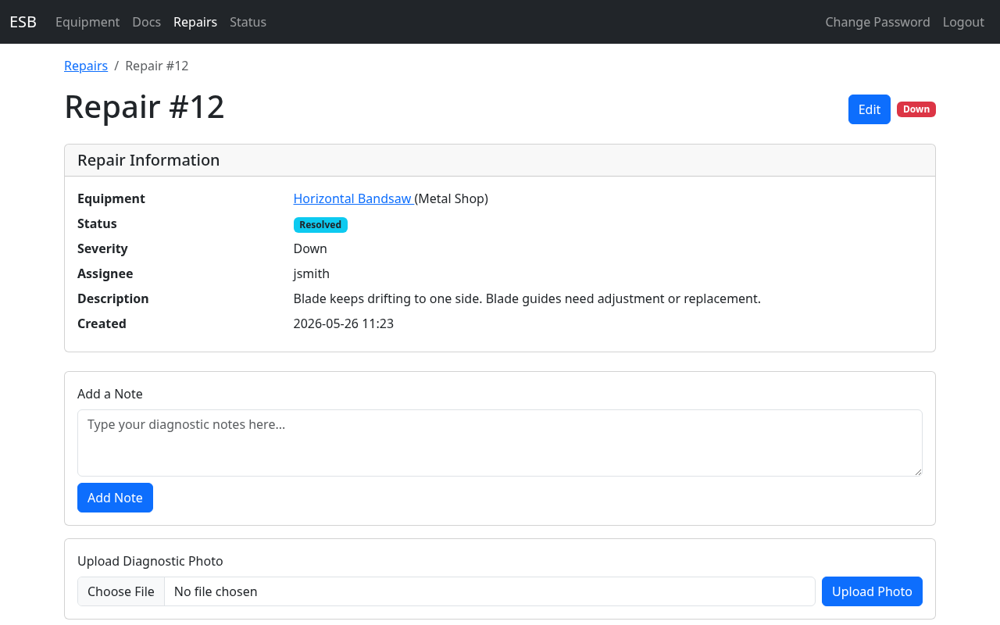
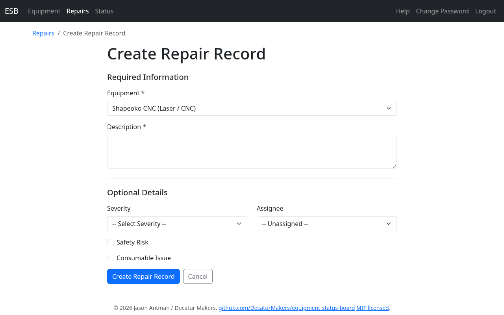
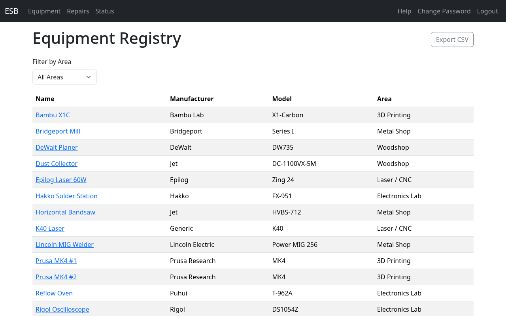

<!--
RENDER:  npx @marp-team/marp-cli docs/training/technicians.md --html --allow-local-files -o technicians.pdf
         (swap -o technicians.html or technicians.pptx for other formats)
Images live in ../images relative to this file.
PRESENTER: fill in the ESB web address posted in your space.
-->

<!-- _class: lead -->

# Equipment Status Board
### Technician Training

Work the repair queue from the web or from Slack

<!-- Presenter: 25–30 min. Audience = volunteer repair techs with accounts. They already know the member-facing basics; this deck is the repair workflow + tech Slack commands. -->

---

## What's different for you

- You have an **account** — everything members do, **plus** the repair workflow
- Your home base is the **Repair Queue**
- You can do most day-to-day work from **Slack** — claim, set ETA, change status, resolve
- Deeper edits (severity, reassign, multi-field) happen in the **web UI**

Roles: <strong>technician</strong> = repairs + equipment. <strong>staff</strong> = all that + create/edit equipment and admin. Staff inherits every technician ability.

---

## Where the tools work 📶 (important for you)

**Slack works anywhere.** Use it when you're off-site.

The **web UI and QR pages are on the makerspace network** — reach them **on WiFi**, **or over VPN** if you have access.

- This is the technician advantage: triage and update repairs **from home via VPN or Slack**
- A QR sticker scanned off-network still won't open unless you're on VPN

<!-- Presenter: members do NOT get VPN — that access is technicians only. -->

---

## Logging in

- Staff create your account; you get a **temporary password** (usually via **Slack DM**)
- Go to the ESB web address → enter **username + password**
- First thing: **Change Password** (top-right nav)
- After login you land on the **Repair Queue**

No self-signup. Forgot your password? A staff member resets it.

---

## Status & severity — how the colors are computed

✓ Operational
! Degraded
✗ Down

- Equipment status is **derived live** from its **open repair records** — never set by hand
- It reflects the **highest-severity open repair**:

| Severity you set | Equipment shows |
|---|---|
| **Down** | 🔴 Down |
| **Degraded** | 🟡 Degraded |
| **Not Sure** | 🟡 Degraded |
| *(no open repairs)* | 🟢 Operational |

- Close every open repair and the machine returns to **green** automatically

---

## The Repair Queue

- Default sort: **Down first, then oldest** — top = most urgent
- **Filters:** Area · Status · Assignee (**All / Mine / Unassigned**)
- Click a column to sort; click a row to open the record
- Inline quick actions:
  - **Claim** — on `New` items → assigns you, moves to `Assigned`
  - **Resolve** — opens a note prompt, sets `Resolved`

Filtered URLs are shareable/bookmarkable: <code>?area=</code>, <code>?status=</code>, <code>?assignee=me</code>

---

## The Queue on your phone

- Rows become **stacked cards** — equipment, severity, status, area, age
- Built for **one-handed** use at the workbench
- Same Claim / Resolve actions
- On WiFi or VPN, this is your shop-floor triage view

---

## The Repair Record

- Top: equipment, status, severity, assignee, description
- **Add a Note** — what you found, tried, ordered
- **Upload a diagnostic photo/video**
- **Timeline** below = the **institutional memory**:
  - every status / severity / assignee / ETA change + notes + photos, with who & when

Read the timeline first — don't redo diagnosis someone already did.

---

## Working a repair — the Edit screen

- One **Edit** form changes everything; batch it and **save once**:
  - **Status** · **Severity** · **Assignee** · **ETA** · **Specialist description** · **Duplicate-of**
- Every change writes a **timeline entry** automatically
- Quick paths for the two common actions (no full edit needed):
  - **Claim** → assigns you (and `New` → `Assigned`)
  - **Resolve** → requires a note, sets `Resolved`
- Set an **ETA** on anything waiting — it shows on the dashboard and tells everyone when to expect the tool back

---

## The repair workflow — statuses

| Status | Use it when… |
|---|---|
| **New** | Just reported, not yet assessed *(starting point)* |
| **Assigned** | You've taken ownership (Claim does this) |
| **In Progress** | Actively diagnosing / fixing |
| **Parts Needed** | Diagnosed; parts must be sourced |
| **Parts Ordered** | Ordered — note order + ETA |
| **Parts Received** | In hand, ready to install |
| **Needs Specialist** | Beyond current skills/tools — note what's needed |
| **Resolved** | Fixed, back in service |
| **Closed – No Issue Found** | Couldn't reproduce a problem |
| **Closed – Duplicate** | Tracked elsewhere — link the other record |

First 7 are "open" (and are the Kanban columns); last 3 are closed and clear the status.

---

## Creating a repair record (web)

- **Equipment page → Report Issue** — opens this form with the **equipment pre-selected**
- Or **Repairs → New** and pick the equipment
- Required: **Equipment + Description**; optional severity / assignee / safety / consumable
- Save → you're taken to the new record

Members' reports land here too, as <code>New</code>.

---

## Equipment registry & docs

- **Equipment** nav → browse everything, filter by area, **Export CSV**
- Open any item for specs, **manuals, photos, and links**
- Pull up the manual mid-repair from your phone
- If staff enable **technician doc editing**, you can add manuals / photos / links you find

Creating, editing, or archiving equipment itself is staff-only.

---

## Slack — three commands

| Command | Who | What |
|---|---|---|
| /esb-status | anyone | Check status — all areas, one area, or one machine |
| /esb-report | anyone | Quick member-style problem report |
| /esb-repair | **tech/staff** | Your work command — dispatcher + create record |

- Slack maps you to your ESB account by **email**, and re-checks your role at every step
- This is how you stay on top of repairs **off-network**

---

## Slack — `/esb-repair` with no argument (dispatcher)

- Type /esb-repair → modal lists **open repairs grouped by area**
- Pick one → **Continue** → choose one **Action**:

> ○ **Claim (assign to me)** — `New` → `Assigned`, else just sets assignee
> ○ **Set ETA** — pick a date
> ○ **Set Status** — In Progress / Closed – Duplicate / Closed – No Issue Found
> ○ **Resolve with Note** — note required → `Resolved`

- **No repair ID needed** — easiest path for routine in-Slack updates

---

## Slack — `/esb-repair <equipment>` (create)

- Type /esb-repair Shapeoko → **create-record modal** opens
- Exact name match → equipment **pre-selected**; otherwise pick from the dropdown
- Fill description, severity, assignee, status → submit

> ✅ Repair #43 created for **Shapeoko CNC** (Laser / CNC)

An argument always means "create". No argument always means the dispatcher.

---

## Slack — notifications you'll see

Posted to the equipment's **area channel** + cross-posted to **#oops**:

- 🚨 new report ·   ⚠️ **SAFETY RISK** prefix
- 🔧 severity changed ·   🔄 status changed ·   👤 assignee changed
- 📅 ETA set/changed ·   ✅ resolved / closed ·   ❌ error

Direct messages are only used to deliver your temporary password. Slash-command replies are private (ephemeral) to you.

---

## When you still need the web UI

Slack covers claim / ETA / status / resolve / create. Use the **web record** for:

- Changing **severity**
- **Reassigning** to someone else
- Setting a **specialist description**
- **Uploading diagnostic photos**
- Editing **several fields at once**

Rule of thumb: quick updates in Slack, detailed work on <code>/repairs/&lt;id&gt;</code> in the browser.

---

## Recap — technician cheat sheet

- **Log in → Repair Queue.** Change your temp password first.
- **Triage:** Down-first, oldest-first; filter to **Mine** / **Unassigned**
- **Claim → work → note everything → Resolve** (note required)
- Status is **derived** from open repairs; close them and it goes green
- **Slack /esb-repair** for off-network claim/ETA/status/resolve
- 📶 Web + QR on **WiFi or VPN**; Slack anywhere
- **Read the timeline** before you start

Full reference: Help / Docs → Technicians Guide.

